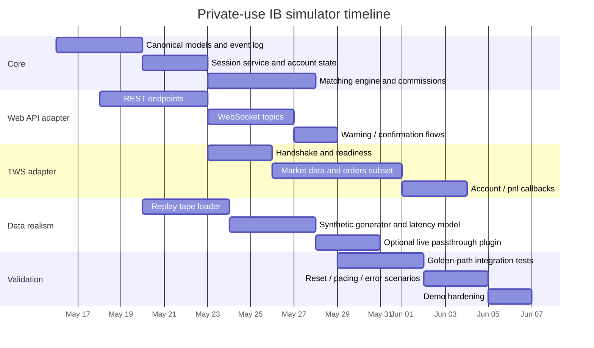

# Interactive Brokers API Simulator Design Brief

## Executive summary

The most practical way to build a **private-use, high-fidelity IB simulator** is a **single canonical trading engine** with **two protocol adapters** on top: one adapter that emulates the **IBKR Web API / Client Portal API** over REST + WebSocket, and one adapter that emulates the **TWS / IB Gateway socket API** at the request/callback level. This avoids duplicating business logic while preserving the most important observable IB behaviors: session gating, contract discovery, order lifecycle, market data subscriptions, executions, portfolio/account state, PnL, commissions, margin preview, and common connectivity / error flows. IB’s official docs make clear that the Web API is HTTP + WebSocket and that the TWS API is a TCP socket message protocol; both are front ends over trading, market data, and account services. citeturn23view0turn36search1turn13view0

For a demo, do **not** try to reproduce every IB feature or every obscure order type. The highest-value fidelity comes from: realistic **sessions**, **contract resolution**, **top-of-book + depth + historical bars**, **common order types**, **order warnings / confirmations**, **fills / commissions / PnL**, and **reset / reconnect behavior**. IB’s own docs also show meaningful differences you should preserve rather than flatten away: Web API brokerage-session rules, preflight requirements for market data, pacing limits, WebSocket keepalive, warning-confirmation order flows, TWS `nextValidId` readiness, open-order binding by `clientId`, nightly resets, and different update cadences for account data vs PnL. citeturn7view0turn25view5turn25view1turn27view0turn13view0turn13view1turn19view1turn19view2

If “as real as possible” is the goal, the simulator should support **three market-data modes** behind the same API surface: **synthetic**, **replay**, and **live passthrough plugin**. Replay should be the default realism mode for demos, using either your own captured IB-compatible logs / snapshots or other legally authorized datasets. Live passthrough should remain optional because IB ties market data and brokerage sessions to usernames, limits one trading-enabled session per username across platforms, and charges market-data subscriptions per username. citeturn23view0turn7view0turn34view2turn34view3

## API scope and priorities

A good simulator should expose **IB-like behavior, not just IB-like JSON**. That means preserving state transitions, pacing, and asynchronous callbacks. For Web API, preserve the two-tier session model, `/iserver` brokerage gating, `/tickle` + WS keepalive expectations, and the recent rule that `smd` market-data subscriptions expire after 10 minutes unless renewed. For TWS, preserve readiness via `nextValidId`, reconnect/reset codes, subscription semantics, order ownership by `clientId`, and the daily-reset operational model. citeturn7view0turn27view0turn11view0turn13view0turn13view1turn35view0

| Capability | Demo priority | Complexity | What “realistic enough” means | Evidence |
|---|---|---:|---|---|
| Sessions and auth gating | Must | Low | Web API read-only vs brokerage session; TWS connect → `nextValidId`; reset/reconnect behaviors | citeturn7view0turn23view0turn13view0turn13view1 |
| Contract discovery | Must | Medium | Stocks, FX, futures, simple options via conid / secdef flow; trading hours / timezone in details | citeturn28view1turn28view7turn19view0 |
| Top-of-book market data | Must | Medium | Snapshot + streaming; delayed/live flags; field-tag behavior; TWS aggregated snapshots cadence | citeturn25view5turn8view0turn26view6turn19view4turn19view5 |
| Order placement lifecycle | Must | High | MKT, LMT, STP, STP LMT, TRAIL / TRAILLMT; warnings, confirmations, cancel/modify, partial fills | citeturn7view2turn25view0turn25view1turn31view3turn13view2turn19view6turn19view7 |
| Executions and commissions | Must | Medium | `execDetails` / `commissionReport`; Web API trade stream and executions list | citeturn13view8turn27view2turn27view3 |
| Account / portfolio / positions | Must | Medium | Account summary, positions, ledger-like portfolio summary, update intervals similar to IB | citeturn25view7turn25view8turn19view1turn19view3 |
| PnL | Must | Medium | TWS account-window vs portfolio-window distinction; ~1s `pnlSingle`; Web API `spl` topic fields | citeturn19view2turn27view1 |
| Historical bars | Must | Medium | Web API 1000-point cap + 5 concurrent requests; TWS `reqHistoricalData` semantics | citeturn25view6turn13view7 |
| Market depth | Should | High | TWS `reqMktDepth`; Web API `sbd` book ladder with account/conid topic form | citeturn13view6turn26view2 |
| Real-time bars | Should | Medium | TWS 5-second bars only | citeturn13view4 |
| Tick-by-tick | Should | High | TWS `Last`, `AllLast`, `BidAsk`, `MidPoint`; options historical-only, not live | citeturn13view5turn19view4 |
| Margin preview / what-if | Should | Medium | Pre-trade margin + commission preview on both APIs | citeturn25view2turn30view0turn30view1 |
| Advanced orders | Nice | High | Brackets first; then OCA / combos / conditional orders | citeturn20search3turn18search4turn20search11turn25view3 |
| Full raw TWS parity | Avoid initially | Very high | Only after subset works end-to-end; public prose docs do not fully specify every wire nuance | citeturn36search1turn32view0turn34view4 |

**Recommended demo subset.** Support only: **STK, CASH/FX, FUT, OPT**; **MKT/LMT/STP/STP LMT/TRAIL/TRAILLMT**; **DAY/GTC/IOC**; **outsideRTH**, **brackets**, **what-if**, **top-of-book**, **historical bars**, **depth**, **executions**, **PnL**, **account summary**, **portfolio positions**, **common error/reset codes**. Add **combo/spread** only if your demo specifically needs options strategies; IB supports combos in both trading and, in WebSocket docs/comments, combo market-data flows, but that complexity is not required for a convincing general demo. citeturn25view0turn31view2turn20search3turn10view0

## Required protocol surface

Below is the minimum surface area Codex / Claude Code should implement. For Web API, use IB’s official endpoint names and WebSocket topic names. For TWS, model the subset as request/callback pairs using the official method/event names, even if your first implementation uses an internal normalized message bus. IB explicitly documents the Web API endpoint/topic forms and the TWS API as a message protocol over TCP sockets. citeturn23view0turn36search1turn33search15

| Surface | IB-compatible shape | Required behavior | Example |
|---|---|---|---|
| Session status | Web: `/iserver/auth/status`, `/tickle`, WS `tic`; TWS connect + `nextValidId` | Keepalive, ready-state, competing-session simulation | WebSocket `tic`; TWS emits `nextValidId(1001)` after handshake citeturn27view0turn13view0 |
| Brokerage accounts | Web: `GET /iserver/accounts`; TWS `managedAccounts` equivalent account list | Must exist before modifying/canceling/querying orders in Web API | `{"accounts":["U1234567"],"supportsCashQty":true}` citeturn25view9turn11view0 |
| Portfolio accounts | Web: `GET /portfolio/accounts` | Required before `/portfolio/*` | account list with `accountId`, `currency`, `type`, `tradingType` citeturn25view7turn7view4 |
| Contract search | Web: `GET /iserver/secdef/search`, `/iserver/secdef/strikes`, `/iserver/secdef/info`, `/iserver/contract/{conid}/info`; TWS `reqContractDetails` | Maintain conid-first identity and derivative discovery flow | `symbol=SPX` → underlying conid + option months; then strikes/info validation citeturn28view1turn28view7turn19view0 |
| Top-of-book snapshot | Web: `GET /iserver/marketdata/snapshot`; TWS `reqMktData` | Preflight in Web API; fields-tag behavior; delayed/live indicators | `?conids=265598&fields=31,84,86,85,88,7059` citeturn25view5turn8view0turn26view6 |
| Top-of-book stream | Web WS `smd+CONID+{"fields":[...]}` / `umd+CONID+{}`; TWS market-data subscriptions | Renew Web `smd` every 10 minutes; TWS cadence by product type | `smd+8314+{"fields":["31","84","86"]}` citeturn8view0turn11view0turn19view4 |
| Historical bars | Web: `GET /iserver/marketdata/history`; TWS `reqHistoricalData`; TWS `reqRealTimeBars` | Respect Web 5-concurrent / 1000-point limits; TWS `keepUpToDate`; real-time bars only 5s | `conid=265598&period=1d&bar=1h&outsideRth=true&source=Midpoint` citeturn25view6turn24view3turn13view7turn13view4 |
| Market depth | Web WS `sbd+acctId+conid(+exchange)` / `ubd+acctId`; TWS `reqMktDepth` → `updateMktDepth(L2)` | Ladder snapshots + updates; account-scoped topic for Web | ladder rows with `row`, `focus`, `price`, `bid` / `ask` citeturn26view2turn27view4turn13view6 |
| Orders | Web: `POST /iserver/account/{accountId}/orders`, `DELETE /iserver/account/{accountId}/order/{orderId}`; TWS `placeOrder`, `cancelOrder` | Immediate submit or warning-confirm path; modify/cancel; partial fills | Web body below; TWS emits `openOrder` → `orderStatus` → `execDetails` → `commissionReport` citeturn7view2turn25view0turn25view3turn13view2turn13view8 |
| Order warnings / prompts | Web: `/iserver/reply/{replyId}` and `/iserver/notification`; TWS `openOrder` warnings / `error` | Must emulate both success and confirm-before-send flows | stop-order warning or no-market-data warning citeturn25view1turn31view3turn36search9 |
| Open orders / order stream | Web: `GET /iserver/account/orders`, WS `sor+{...}` / `uor+{}`; TWS `reqOpenOrders` / `reqAllOpenOrders` / `reqAutoOpenOrders` | Preserve client ownership / binding semantics on TWS; Web returned day-order list | `filters=filled&force=true`; `sor+{"filters":["Submitted"]}` citeturn24view0turn27view0turn19view6turn19view7 |
| Executions / trades | Web WS `str+{"realtimeUpdatesOnly":false,"days":1}`; TWS `reqExecutions` + `execDetails` | Execution IDs, timestamps, side, size, price, exchange, commission | fields: `execution_id`, `trade_time`, `price`, `net_amount`, `conid` citeturn27view2turn27view3turn13view8 |
| PnL | Web WS `spl+{}` / `upl+{}`; TWS `reqPnL`, `reqPnLSingle`, `updateAccountValue` | Web `dpl/nl/upl/uel/mv`; TWS account-window vs portfolio-window distinction | `{"topic":"spl","args":{"U123.Core":{"dpl":...}}}` citeturn27view1turn19view2 |
| Account summary / positions | Web: `/portfolio/{accountId}/summary`; TWS `reqAccountUpdates`, `reqAccountSummary`, `reqPositions` | 3-minute account-summary cadence; positions and cash/equity fields | summary returns 45–135 keys across base/securities/commodities views citeturn25view8turn19view1turn19view3 |
| Margin / commissions preview | Web: `POST /iserver/account/{accountId}/orders/whatif`; TWS `placeOrder` with `WhatIf=true` | Return amount / commission / equity / margin impacts without live order | what-if example below citeturn25view2turn31view2turn30view0turn30view1 |

**Web API order payload example.** The official docs show that order bodies are arrays and that the minimum fields are the contract id, order type, side, time-in-force, and quantity; richer examples include `conidex`, `outsideRTH`, `trailingAmt`, `cashQty`, `manualIndicator`, and adaptive/algo fields. Futures and futures-option order actions must include `manualIndicator` to stay compliant with CME Rule 536-B. citeturn7view2turn25view0turn25view3turn11view0

```json
POST /v1/api/iserver/account/U1234567/orders
{
  "orders": [
    {
      "acctId": "U1234567",
      "conid": 265598,
      "conidex": "265598@SMART",
      "secType": "265598@STK",
      "cOID": "AAPL-BUY-100",
      "side": "BUY",
      "orderType": "LMT",
      "price": 185.50,
      "quantity": 100,
      "tif": "DAY",
      "outsideRTH": false,
      "manualIndicator": true
    }
  ]
}
```

**Web API order-response behaviors.** Simulate both the **happy path** and the **reply-confirmation path**. The happy path returns `order_id`, `order_status`, and `encrypt_message`. The alternate path returns `id`, `message`, `isSuppressed`, and `messageIds`, after which the client must confirm; stale confirmations can fail with timeout-like behavior, and the docs warn that a reply must be confirmed before subsequent orders are sent. citeturn25view1turn25view4turn31view3

```json
[
  {
    "order_id": "1234567890",
    "order_status": "Submitted",
    "encrypt_message": "1"
  }
]
```

```json
[
  {
    "id": "a12b34c5-d678-9e012f-3456-7a890b12cd3e",
    "message": [
      "You are about to submit a stop order..."
    ],
    "isSuppressed": false,
    "messageIds": ["o10331"]
  }
]
```

**TWS simulator contract.** For TWS, the cleanest implementable contract is a request/callback matrix: `connect → nextValidId`, `reqContractDetails → contractDetails`, `reqMktData → tickPrice/tickSize/marketDataType`, `reqHistoricalData → historicalData/historicalDataEnd`, `reqRealTimeBars → realtimeBar`, `reqTickByTickData → tickByTick*`, `reqMktDepth → updateMktDepth(L2)`, `placeOrder → openOrder/orderStatus/(execDetails, commissionReport)`, `reqAccountUpdates → updateAccountValue/updatePortfolio/accountDownloadEnd`, `reqAccountSummary → accountSummary/accountSummaryEnd`, `reqPnLSingle → pnlSingle`. This matches the official EClient/EWrapper model and is enough for most client code. citeturn13view0turn13view2turn19view0turn19view1turn19view2turn13view4turn13view5turn13view6turn13view8turn33search15

## Architecture and data strategy

Use this architecture:

```text
clients
  ├─ Web API adapter  (REST + WebSocket)
  ├─ TWS adapter      (TCP socket, subset protocol)
  └─ optional gRPC admin / control plane
        ↓
canonical simulator core
  ├─ session service
  ├─ contract master
  ├─ market-data service
  ├─ matching / fill engine
  ├─ risk + margin preview
  ├─ account / portfolio / pnl service
  ├─ commission model
  └─ event log / deterministic clock
        ↓
persistence + data plugins
  ├─ SQLite/Postgres
  ├─ replay tapes
  ├─ synthetic generators
  └─ live passthrough plugin
```

The **canonical core** should own normalized entities: `Contract`, `Order`, `Execution`, `Position`, `AccountLedger`, `Quote`, `BookLevel`, `Bar`, `PnLSnapshot`, `SessionState`, and `ErrorEvent`. Both adapters translate to and from these objects. This is especially important because the Web API and TWS APIs expose the same economic events with different envelopes and update cadences. That difference is explicit in the docs for account/PnL and market data, and it should be modeled rather than hidden. citeturn19view1turn19view2turn25view5turn27view1

**Data strategy.** Implement three sources behind one `MarketDataProvider` interface:

| Mode | Best use | Fidelity notes | Practical guidance |
|---|---|---|---|
| Synthetic | deterministic tests, CI, demos without data licenses | easiest to control latency, halts, gaps, crossed books | generate midprice with GBM / OU + intraday seasonality; derive spread, top-of-book sizes, and bars deterministically |
| Replay | best default for realistic demos | preserves real session shapes, news shocks, spread regimes, open/close behavior | store raw ticks / snapshots / bars / books in time-partitioned files; replay on a controllable clock |
| Live passthrough plugin | highest realism for internal demos | session conflicts and licensing constraints matter | use only with authorized data; prefer separate username / paper setup if you need concurrent live systems citeturn23view0turn34view2turn34view3 |

**Replay source recommendations.** Capture your own **paper-account** sessions or your own entitled market-data sessions, then replay them privately. IB states that paper trading uses the full range of trading features and mirrors trading permissions, market-data subscriptions, base currency, and account-type configuration of the regular account, which makes paper a strong golden-reference environment for recording realistic flows. IB also documents that market data can be included in API logs and that historical candlestick data is always recorded in the API log; that makes logs a viable source of replay fixtures, subject to your subscription terms and data-license restrictions. citeturn17search17turn17search4turn34view0

**Synthetic market model.** For a convincing demo, use a **hybrid synthetic model** rather than naïve random walk output:  
`mid_t = regime_trend + intraday_seasonality + jump_process + micro_noise`.  
Then derive `bid/ask = mid ± half_spread`, where spread follows a regime model tied to time-of-day and volatility; sizes follow heavy-tailed queues; depth decays with distance from mid; bar OHLCV is reconstructed from generated ticks; delayed/frozen modes follow the official TWS market-data-type semantics. This lets you simulate realistic opens, lunch-hour spread compression, close auctions, halted states, and delayed/frozen fallbacks while staying deterministic under a seed. The need to preserve delayed/frozen distinctions and product-dependent L1 cadence is documented by IB. citeturn19view5turn19view4

**Matching / fill engine.** For a demo, use **best-effort “IB-style execution semantics,” not a full exchange simulator**:
- Market orders fill against current book immediately, with price capped by realistic guardrails.
- Limit orders execute if marketable, otherwise rest in a local book.
- Stop orders trigger when last/bid/ask hits the trigger condition; then convert to market or limit depending on type.
- Trailing orders recompute trigger/limit as price moves.
- Brackets create one parent + two children with parent-held activation, matching IB’s attached-order semantics.
- Partial fills are sized from displayed liquidity and replenishment rules; commissions are computed per asset-class schedule; PnL updates cascade to positions/account summary.  
This design matches IB’s documented bracket-parent behavior and the distinction between order submission, open-order state, executions, and commissions. citeturn20search3turn18search4turn13view2turn13view8

**Latency / jitter simulation.** Inject latency at three layers: ingress, matching, and egress. Use distributions, not constants: REST 20–120 ms, WebSocket market data 5–80 ms in replay mode, TWS socket callbacks 2–50 ms for local-demo mode; add burst jitter around market open and during resets. Also model queueing and backpressure when clients exceed pacing. This is important because IB explicitly publishes Web pacing and TWS rate behavior. citeturn7view0turn36search3

**Recommended stacks.**  
Python is the fastest path for a faithful simulator because IB officially supports Python for TWS, the Web API is language-agnostic, and the Python ecosystem is strong for validation, deterministic time control, and schema-heavy services. Node.js is very good for the Web API surface and fast WebSocket work, but any TWS compatibility layer will rely on unofficial ports. Go is excellent for a single static-binary service, but both Web API and TWS Go wrappers are unofficial. citeturn20search4turn23view0turn16search2turn16search0turn16search1turn16search10

| Layer | Python recommendation | Node recommendation | Go recommendation |
|---|---|---|---|
| REST/WS adapter | FastAPI, Pydantic, Uvicorn | Express / Fastify + `ws` | Chi / Gin + Gorilla WebSocket |
| TWS adapter | custom socket server; optional decode helpers from official API source during development | custom socket server; `@stoqey/ib` useful only as client-reference wrapper, not as server | custom socket server; `ibkr-go` / `ibclientportal` useful as client references |
| Persistence | SQLite WAL for demo; Postgres optional | SQLite / Postgres | SQLite / Postgres |
| Eventing | asyncio queues | EventEmitter / RxJS | channels |
| Testing | pytest + snapshot fixtures + hypothesis | vitest / jest + fixture tapes | `go test` + golden files |

Use **internal gRPC only if you split adapters from engine**. Do **not** expose gRPC as the primary external compatibility surface; Codex/Claude should treat REST/WS and TWS socket parity as the product, and gRPC only as an optional internal API.

## Code skeletons and repo layout

Use a repository layout that keeps the compatibility logic thin and the domain engine authoritative:

```text
ib-sim/
  core/
    models.py
    sessions.py
    contracts.py
    marketdata.py
    matching.py
    accounts.py
    commissions.py
    errors.py
  adapters/
    webapi/
      rest.py
      ws.py
      schemas.py
    tws/
      server.py
      decoder.py
      encoder.py
      mappings.py
  data/
    contracts.json
    replay/
    seeds/
  tests/
    fixtures/
    integration/
  docs/
    ib-sim-spec.md
```

The Python skeleton below shows the pattern: a Web API endpoint and a WS topic both hit the same core state. The result is not the full simulator; it is the shape Codex/Claude Code should expand. The IB-specific endpoint names and field tags come directly from the official docs. citeturn25view5turn27view0turn27view1

```python
# adapters/webapi/rest.py
from fastapi import FastAPI, WebSocket, HTTPException
from pydantic import BaseModel
from typing import List, Optional
import time, asyncio

app = FastAPI()

QUOTES = {
    265598: {"31": "189.10", "84": "189.08", "86": "189.12", "85": "400", "88": "500", "7059": "100"}
}
ORDERS = {}
NEXT_ORDER_ID = 1000001

class OrderTicket(BaseModel):
    conid: int
    side: str
    orderType: str
    tif: str
    quantity: float
    price: Optional[float] = None
    auxPrice: Optional[float] = None
    outsideRTH: Optional[bool] = False
    manualIndicator: Optional[bool] = True
    cOID: Optional[str] = None

class OrdersBody(BaseModel):
    orders: List[OrderTicket]

@app.get("/v1/api/iserver/accounts")
def iserver_accounts():
    return {"accounts": ["U1234567"], "selectedAccount": "U1234567", "supportsCashQty": True, "supportsFractions": True}

@app.get("/v1/api/iserver/marketdata/snapshot")
def md_snapshot(conids: str, fields: str):
    out = []
    for c in [int(x) for x in conids.split(",")]:
        q = {"conid": c, "conidEx": str(c), "_updated": int(time.time() * 1000), "server_id": "q1"}
        q.update(QUOTES.get(c, {}))
        out.append(q)
    return out

@app.post("/v1/api/iserver/account/{account_id}/orders")
def place_order(account_id: str, body: OrdersBody):
    global NEXT_ORDER_ID
    t = body.orders[0]
    if t.side not in {"BUY", "SELL"}:
        raise HTTPException(400, "Invalid Side (must be 'BUY' or 'SELL').")
    order_id = NEXT_ORDER_ID
    NEXT_ORDER_ID += 1
    ORDERS[order_id] = {"account": account_id, "status": "Submitted", **t.model_dump()}
    return [{"order_id": str(order_id), "order_status": "Submitted", "encrypt_message": "1"}]

@app.websocket("/v1/api/ws")
async def ws_endpoint(ws: WebSocket):
    await ws.accept()
    while True:
        msg = await ws.receive_text()
        if msg == "tic":
            continue
        if msg.startswith("sor+"):
            while True:
                await ws.send_json({"topic": "sor", "args": [
                    {"acct": "U1234567", "orderId": oid, "conid": o["conid"], "status": o["status"], "side": o["side"],
                     "orderType": o["orderType"], "timeInForce": o["tif"], "remainingQuantity": o["quantity"],
                     "filledQuantity": 0.0, "order_ref": o.get("cOID")}
                    for oid, o in ORDERS.items()
                ]})
                await asyncio.sleep(1.0)
        if msg.startswith("spl+"):
            await ws.send_json({"topic": "spl", "args": {
                "U1234567.Core": {"rowType": 1, "dpl": 125.40, "nl": 100250.00, "upl": 220.10, "uel": 80250.00, "mv": 20000.00}
            }})
```

The Node.js skeleton shows the same core idea with an HTTP endpoint and WS topic router. It is optimized for CP/Web API simulation; if you implement only one adapter first, this is the one to build first. citeturn23view0turn25view5turn27view0

```javascript
// adapters/webapi/server.js
import express from "express";
import http from "http";
import { WebSocketServer } from "ws";

const app = express();
app.use(express.json());

let nextOrderId = 1000001;
const quotes = {
  265598: { "31": "189.10", "84": "189.08", "86": "189.12", "85": "400", "88": "500", "7059": "100" }
};
const orders = new Map();

app.get("/v1/api/iserver/accounts", (_req, res) => {
  res.json({ accounts: ["U1234567"], selectedAccount: "U1234567", supportsCashQty: true, supportsFractions: true });
});

app.get("/v1/api/iserver/marketdata/snapshot", (req, res) => {
  const conids = String(req.query.conids || "").split(",").filter(Boolean).map(Number);
  const payload = conids.map((c) => ({
    conid: c,
    conidEx: String(c),
    server_id: "q1",
    _updated: Date.now(),
    ...(quotes[c] || {})
  }));
  res.json(payload);
});

app.post("/v1/api/iserver/account/:accountId/orders", (req, res) => {
  const t = req.body?.orders?.[0];
  if (!t || !["BUY", "SELL"].includes(t.side)) {
    return res.status(400).json({ error: "Invalid Side (must be 'BUY' or 'SELL')." });
  }
  const orderId = nextOrderId++;
  orders.set(orderId, { ...t, accountId: req.params.accountId, status: "Submitted" });
  res.json([{ order_id: String(orderId), order_status: "Submitted", encrypt_message: "1" }]);
});

const server = http.createServer(app);
const wss = new WebSocketServer({ server, path: "/v1/api/ws" });

wss.on("connection", (ws) => {
  let timer = null;
  ws.on("message", (buf) => {
    const msg = buf.toString();
    if (msg === "tic") return;
    if (msg.startsWith("spl+")) {
      ws.send(JSON.stringify({
        topic: "spl",
        args: { "U1234567.Core": { rowType: 1, dpl: 125.4, nl: 100250, upl: 220.1, uel: 80250, mv: 20000 } }
      }));
      return;
    }
    if (msg.startsWith("sor+")) {
      clearInterval(timer);
      timer = setInterval(() => {
        ws.send(JSON.stringify({
          topic: "sor",
          args: [...orders.entries()].map(([orderId, o]) => ({
            acct: o.accountId, orderId, conid: o.conid, status: o.status, side: o.side,
            orderType: o.orderType, timeInForce: o.tif, remainingQuantity: o.quantity, filledQuantity: 0
          }))
        }));
      }, 1000);
    }
  });
  ws.on("close", () => timer && clearInterval(timer));
});

server.listen(5000);
```

**TWS adapter note.** If the demo must support **real TWS API clients** rather than your own wrapper, implement the socket adapter as a narrow compatibility layer over the canonical core and treat the official client code / sample app as the oracle for handshake, message ordering, and field serialization. IB publishes the official TWS API repo and states that the API is fundamentally a message protocol over TCP; the public prose docs are enough for behavior, but not for every low-level wire nuance. citeturn32view0turn36search1turn34view4

## Validation, runbook, security, and licensing

**Validation scenarios.** Use scenario-based tests that compare the simulator’s external behavior to official IB semantics, not just unit tests against internal functions.

| Scenario | Expected outcome | Evidence |
|---|---|---|
| Web login / brokerage gating | non-`/iserver` works before brokerage init; `/iserver` denied until brokerage session established | citeturn7view0turn23view0 |
| Web market-data preflight | first snapshot request opens stream and may return only conids; subsequent requests return fields | citeturn7view1turn8view0 |
| Web `smd` renewal | subscription stops after ~10 minutes unless renewed | citeturn11view0 |
| Web stop-order warning flow | order returns `id/message/messageIds`; confirm path required before final submission | citeturn31view3turn25view4 |
| TWS connect readiness | no requests accepted before `nextValidId`; then IDs persist across reconnects | citeturn13view0turn13view2 |
| TWS open-order ownership | `reqOpenOrders` returns only same-`clientId` orders; `reqAllOpenOrders` wider; cancelled/filled not returned | citeturn19view6 |
| PnL timing | TWS `pnlSingle` ~1 Hz; account summary / account updates 3-minute cadence; Web `spl` immediate stream | citeturn19view1turn19view2turn19view3turn27view1 |
| Reset / reconnect | emit 1100 → 1101/1102 style connectivity events; resubscribe semantics configurable | citeturn13view1 |
| Depth + bars | Web `sbd` ladder shape and TWS `reqRealTimeBars(5s)` semantics preserved | citeturn26view2turn13view4turn13view6 |
| Pacing | Web 429 on pacing violations; TWS throttle after excessive message rate | citeturn7view0turn36search3 |

**Minimal runbook.**
1. Start the simulator with a seeded dataset and a fixed clock.  
2. Load canonical contracts: at minimum AAPL stock (`conid 265598` appears in IB docs), IBM (`8314` in market-data examples), one FX pair, one future, and one option chain. citeturn7view2turn8view0  
3. Bring up the Web API adapter on `localhost:5000` to mirror Gateway defaults, plus the TWS socket adapter on a test port. citeturn23view0turn35view1  
4. Run a demo script that does: account discovery → contract search → snapshot → WS `smd` → place order → receive `sor` → fill → `str` trade → `spl` PnL. citeturn25view9turn28view1turn25view5turn27view0turn27view2turn27view1  
5. Run a TWS client script that does: connect → wait `nextValidId` → `reqContractDetails` → `reqMktData` → `placeOrder` → `reqOpenOrders` → `reqPnLSingle`. citeturn13view0turn19view0turn19view4turn13view2turn19view6turn19view2  
6. Trigger a scripted “nightly reset” to verify reconnect and resubscription paths. citeturn13view1turn35view0  
7. Capture golden snapshots of all external responses for regression tests.

**Single-machine deployment.** For a demo, one process is enough: REST + WS adapter, TWS adapter, and core in a single binary/process; SQLite WAL is sufficient for orders, executions, and replay indexes. Multi-process or Kubernetes adds little value unless you are load-testing client concurrency. This recommendation aligns with IB’s own architecture assumptions for local CP Gateway use and socket-based local TWS/IBG connections. citeturn23view0turn35view1

**Security and compliance.** Keep the simulator **offline by default**. If you support a live passthrough plugin, isolate credentials, use separate config profiles for demo vs passthrough, redact logs, and never store reusable cookies or session tokens in plaintext. For real IB integrations, remember that Client Portal Gateway login is intentionally browser-based and not automatable by an official IB mechanism for individual clients; TWS/IB Gateway are GUI-authenticated and headless operation is not supported by IB. citeturn23view0turn35view0

**Licensing and data-use constraints.** This is the most important non-code constraint:
- IB’s **TWS API Non-Commercial License** is for internal / proprietary tools tied to your own IB account usage; it is not the license for selling or redistributing tools to third parties without separate arrangements. citeturn34view4
- IB market-data agreements grant a **non-exclusive, non-transferable** license and explicitly prohibit reproducing, distributing, selling, or commercially exploiting the software/data without consent; do **not** redistribute recorded IB market data or package it with your simulator. citeturn34view0
- Market-data subscriptions are generally required for API use, are subject to minimum-equity and acknowledgement requirements, and are billed **per username**; subscriptions cannot be shared between usernames. citeturn34view3turn34view2
- If your environment includes Canadian-resident users or Canadian products, note IB’s published restriction on programmatic trading of Canadian products for IBC clients. citeturn23view0



**Open questions / limitations.**  
The public official docs are excellent for **behavioral parity** but do not fully narrate every low-level **TWS wire-format nuance** in one place; if you need arbitrary third-party TWS client compatibility, use the official API code and sample app as your reference oracle under the applicable IB license. Also note that IB’s newer unified Web API reference is explicitly in beta and still coexists with the v1/legacy documentation, so keep your simulator contract versioned and changelog-driven. citeturn32view0turn36search1turn14search9turn6view0