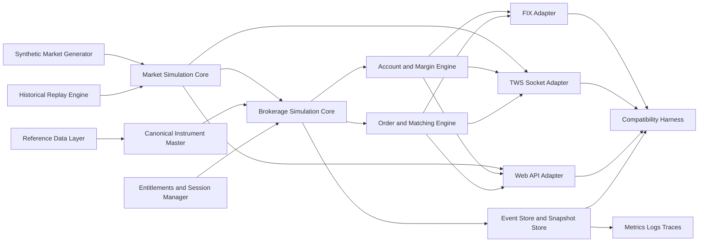
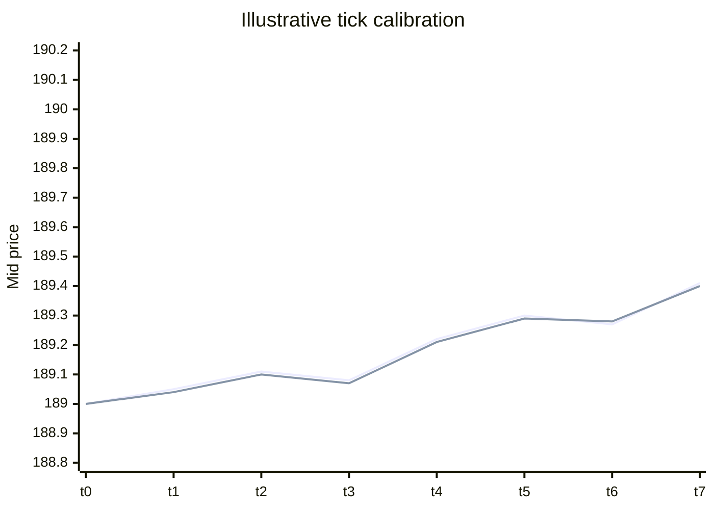
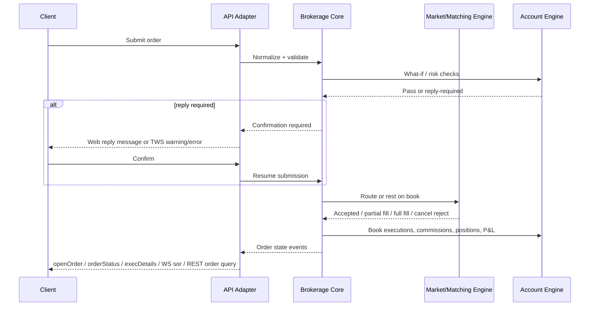

# Private-Use Interactive Brokers API Simulator Design Report

## Executive summary

A high-fidelity private-use Interactive Brokers simulator is feasible, but the right target is **behavioral parity**, not a literal clone of every backend nuance. IB exposes three materially different integration surfaces: a REST/WebSocket Web API that still carries legacy Client Portal session semantics, a TWS/IB Gateway socket API that is fundamentally a version-negotiated message protocol driven by `EClient` requests and `EWrapper` callbacks, and a FIX channel that is relevant only for order routing and institutional workflows, not for market data or portfolio/account state. IB’s own documentation also makes clear that some Web API documentation is still beta/incomplete, while the TWS API ultimately relies on the distributed API source and logs as the deepest reference for behavior. citeturn1view0turn1view1turn1view8turn34view0turn8view0

The strongest design choice is a **shared brokerage simulation core** with **multiple protocol adapters** on top of it: one Web API adapter, one TWS socket adapter, and an optional FIX adapter. The core should own canonical concepts such as instruments, clocks, calendars, market data streams, order state, fills, positions, account summaries, margin snapshots, and event persistence. Each adapter should then translate those canonical events into IB-shaped HTTP responses, WebSocket topics, or `EWrapper` callback sequences. This is the only maintainable way to reproduce IB’s cross-surface inconsistencies on purpose, such as Web API’s two-tier session model and TWS’s duplicate or missing `orderStatus` callbacks. citeturn36view5turn26view0turn30view0

For implementation order, the best path is: **foundation first**, then **Web API MVP**, then **TWS semantic compatibility**, then **market/account realism**, then **compatibility harness**, and only then **FIX**. The Web API is easier to stand up because official endpoint and WebSocket topic shapes are documented, including request pacing, session/tickle behavior, and order confirmation flows. The TWS adapter should come next because it is the harder compatibility surface and the one most likely to break third-party IB clients if semantics drift. FIX should be deferred unless you specifically need institutional demos, because IB states that FIX is order-routing only, uses custom tags in the 5000–9999 range, is tested in a QA system, and is not compatible with ordinary paper-trading accounts. citeturn36view0turn36view1turn36view2turn38view1turn8view0turn8view1

On market data, realism depends more on **data provenance and transform rules** than on transport. IB market data has subscription prerequisites, user-specific entitlements, default market data line limits, different cadence behaviors by product class, separate true tick-by-tick vs watchlist-style top-of-book streams, and hard/soft pacing limits for historical access. For a private demo, the safest choices are licensed non-IB reference feeds, delayed/public feeds for lower-fidelity demonstrations, or synthetic generators calibrated from lawful data. Using raw IB market data as a redistributable seed corpus is legally risky because IB’s subscriber agreement explicitly preserves supplier ownership and prohibits reproduction, distribution, sale, or commercial exploitation without written consent. citeturn20view0turn20view2turn23view0turn23view2turn21view0

On trading/account state, the simulator should reproduce **IB-style order lifecycle quirks**: `nextValidId`, order acknowledgement via `openOrder`, duplicate `orderStatus`, omitted `orderStatus` for fast market fills, parent/child activation, untransmitted orders, account-update cadence, separate account-summary subscriptions, portfolio-window P&L reset semantics, and Web API reply/confirmation prompts. Margin and P&L should initially be explicit approximations, with “what-if” and regulatory checks exposed as explainable rule outputs, because exact IB portfolio margin behavior is difficult to replicate faithfully without proprietary risk logic. citeturn26view0turn28view0turn28view1turn28view2turn4view0turn9view4

The final recommendation is to position the system as a **private simulator for development, demo, QA, and training**, not as a public IB substitute. It should ship with deterministic replay, event-sourced persistence, scenario scripting, compatibility tests against real IB paper or QA sessions, structured logs that look like IB message logs, and a clear legal boundary: no credential automation against real retail IB sessions, no redistribution of IB-originating market data, and no branding that implies affiliation with Interactive Brokers. IB explicitly warns that retail Client Portal Gateway authentication is not officially automatable and recommends against third-party automation for that brokerage-session login flow. citeturn35view0turn34view0turn21view0

## Reality of IB interfaces and the parity target

IB’s current API estate is not one thing. The **Web API** is a unified umbrella that is merging the historical Client Portal Web API, Digital Account Management, and Flex Web Service under shared authorization, while explicitly keeping existing endpoints and auth schemes alive. The **TWS API** is a TCP socket protocol connected to TWS or IB Gateway, with official client libraries in Python, Java, C++, C#, and VB. The **FIX offering** is separate, institutional, and focused on order routing. A simulator that claims “IB parity” therefore needs to state which surface it is simulating at any moment. citeturn1view0turn1view8turn8view0turn7search14

| Interface | Official transport | Auth/session model | What it is best for | Recommended simulator target |
|---|---|---|---|---|
| IB Web API | HTTPS + WebSocket | OAuth variants for organizations; Client Portal Gateway for individuals; read-only outer session plus `/iserver` brokerage session; keepalive via `/tickle` | Browser/mobile-style integrations, RESTful tooling, easier cloud demos | **First adapter to build** because message shapes are explicit and testable. citeturn35view0turn36view5turn36view2turn2view4 |
| TWS / IB Gateway API | TCP socket message protocol | Connect to running TWS/IBG; clientId-scoped session; handshake negotiates common protocol version; readiness indicated by initial callbacks such as `nextValidId` | Highest ecosystem compatibility, existing wrappers, desktop algo tools | **Second adapter to build**, with semantic parity first and raw-wire parity later. citeturn30view0turn1view5turn1view7turn34view0 |
| FIX | FIX session over approved connectivity | Institutional onboarding/certification; dedicated FIX session; QA certification before production | OMS/EMS routing demos, institutional-style order entry | **Optional third adapter**, minimal order-routing subset only. citeturn8view0turn8view1 |

The Web API has important session behavior that many simulators miss. IB documents a **two-tier model**: a read-only outer session that can access non-`/iserver` resources, and a brokerage session needed for trading, market data, and other `/iserver` functionality. A single username can have only one active brokerage session across IB services, and an inactive brokerage session is typically maintained by calling `/tickle` roughly every minute; otherwise it can time out after about five minutes of inactivity. This is not cosmetic: many real clients expect precisely these transitions. citeturn36view5turn36view2turn37view0turn2view4

The Client Portal Gateway also creates specific local-development expectations. IB states that, for individual users, the gateway is a Java-based local reverse proxy, typically on port `5000`, intended to run on the same machine from which requests are made. The gateway commonly uses a self-signed certificate, browser login, and reauthentication at least once after midnight; IB also says there is no official retail mechanism to automate that gateway brokerage-session authentication. Your simulator should therefore support a **Gateway-compatible local mode** that mirrors these UX patterns for compatibility testing, but should not depend on real-IB login automation. citeturn35view0turn36view2turn38view5

The TWS API has a different center of gravity. IB describes it as a **message protocol at its core**, with language libraries acting as transports and decoders over a TCP socket. The connection begins with a version handshake; only after connection completion and initial callbacks such as `nextValidId` should clients be considered ready. TWS or IB Gateway can accept up to 32 client applications simultaneously, distinguished by client ID. For a simulator, this means that the initial release should reproduce **semantic ordering**, thread-safe callback delivery, and version gates before worrying about every byte on the wire. citeturn1view8turn30view0turn1view5

IB’s official guidance also strongly supports using the distributed API code and logs as a reference oracle. The TWS API support pages explicitly say the source code is distributed freely and is a great resource for deeper understanding, and the API message logs can record communications between API applications and TWS/IB Gateway. For a simulator project, that translates directly into a compatibility strategy: **treat docs as the public contract and API logs/source as the behavior oracle**. citeturn34view0

A small but important realism point is that **not all IB data streams mean the same thing**. TWS top-of-book watchlist data is not true tick-by-tick; IB documents it as aggregated snapshots, while separate tick-by-tick APIs exist. By contrast, market depth is unsampled and behaves differently. A good simulator needs to preserve these distinctions so that clients do not accidentally “pass” in simulation with assumptions that break against real IB. citeturn23view2turn24search0turn24search14

## Recommended architecture

The recommended architecture is a **single canonical simulation core** with **protocol-specific façades**. The core owns simulated time, calendars, instrument master, subscriptions, order books, account state, entitlements, pacing, and persistence. Protocol façades then translate between canonical events and IB-native shapes: REST JSON and WebSocket topics for Web API; `EClient`/`EWrapper` request-response semantics for TWS; and eventually FIX session/application messages if you decide FIX is worth the effort.



The key trade-off is whether to build **adapter-specific models** or a **canonical broker model**. Adapter-specific models feel simpler early on, but they create divergence and make parity testing harder. A canonical model is more work at first, but it is the only practical way to reproduce shared facts consistently, such as contract metadata or P&L, while still injecting surface-specific quirks like duplicate TWS `orderStatus` or Web API reply confirmations.

The canonical data model should be explicit and event-oriented. A practical minimum looks like this:

```json
{
  "Instrument": {
    "conid": 265598,
    "symbol": "AAPL",
    "secType": "STK",
    "exchange": "SMART",
    "primaryExchange": "NASDAQ",
    "currency": "USD",
    "tradingClass": "NMS",
    "minTick": 0.01,
    "marketRuleIds": [26],
    "timeZoneId": "US/Eastern",
    "tradingHours": ["2026-05-15:0930-1600"],
    "liquidHours": ["2026-05-15:0930-1600"]
  },
  "MarketTick": {
    "ts": "2026-05-15T13:30:00.125Z",
    "conid": 265598,
    "bid": 189.56,
    "bidSize": 500,
    "ask": 189.61,
    "askSize": 200,
    "last": 189.60,
    "lastSize": 100,
    "source": "replay|synthetic|hybrid"
  },
  "Order": {
    "orderId": 1234567890,
    "permId": 987654321,
    "clientId": 7,
    "account": "DU123456",
    "conid": 265598,
    "side": "BUY",
    "orderType": "LMT",
    "quantity": 100,
    "limitPrice": 165.0,
    "auxPrice": null,
    "tif": "DAY",
    "outsideRth": false,
    "parentId": null,
    "transmit": true,
    "status": "Submitted"
  },
  "Execution": {
    "execId": "0001.abc.01",
    "orderId": 1234567890,
    "conid": 265598,
    "price": 165.00,
    "qty": 25,
    "liquidity": "TAKER",
    "ts": "2026-05-15T13:30:01.410Z"
  },
  "AccountSnapshot": {
    "account": "DU123456",
    "netLiquidation": 100000.00,
    "totalCashValue": 50000.00,
    "buyingPower": 200000.00,
    "initMarginReq": 10000.00,
    "maintMarginReq": 8000.00,
    "availableFunds": 90000.00,
    "excessLiquidity": 92000.00
  }
}
```

Persistence should be **event-sourced**. Every externally visible action should emit a durable event: session-started, contract-resolved, market-subscription-opened, quote-updated, order-submitted, order-confirmation-required, order-confirmed, order-filled, commission-booked, position-updated, account-snapshot-published. Then maintain periodic snapshots for fast restart. This design gives you deterministic replay, excellent observability, and test reproducibility without bolting those on later.

Clocking should be a first-class subsystem. Support three modes: **wall-clock**, **paused/step**, and **compressed replay**. Replay speed should be independently configurable for market data, exchange session progression, and account recalculation. That lets you run “one trading day in five minutes” demos while still preserving causality, subscription pacing, and exchange-open/closed states.

## Protocol emulation and API surface

The **Web API adapter** should start with the subset that real clients most commonly touch. The minimum high-value surface is: session/auth status, keepalive, accounts, portfolio accounts, market-data snapshot/history, order placement, order-reply confirmation, recent orders, and the core WebSocket topics for market data and live orders. IB’s current docs explicitly document the shape of these flows, including `/iserver/auth/status`, `/tickle`, `/iserver/marketdata/snapshot`, `/iserver/marketdata/history`, `/iserver/account/{accountId}/orders`, `/iserver/reply/{messageId}`, and `/iserver/account/orders`, plus WebSocket topics such as `smd` for market data and `sor` for live order updates. citeturn37view0turn36view2turn9view4turn4view0turn4view1turn38view1turn38view5

A simulator should expose **two Web API modes**. The first is a **Gateway-compatible mode** that feels like the retail Client Portal Gateway: local TLS, cookie/session behavior, read-only-then-brokerage session semantics, `/tickle`, and `wss://.../v1/api/ws`. The second is a **direct OAuth mode** for service-to-service testing. Because IB’s current unified Web API docs are still beta and legacy auth methods continue to exist, the simulator should make auth pluggable rather than trying to bake one irreversible assumption into the core. citeturn1view0turn1view1turn35view0turn2view0

A practical Web API parity target is shown below.

| Category | Endpoints / topics to implement first | IB behaviors worth mimicking |
|---|---|---|
| Session | `POST /iserver/auth/status`, `POST /tickle`, `POST /logout` | Two-tier session, `authenticated/connected/competing` flags, keepalive, timeout and re-init behavior. citeturn36view5turn37view0turn37view1turn2view4 |
| Accounts and portfolio | `GET /portfolio/accounts`, `GET /iserver/accounts`, `GET /portfolio/{accountId}/ledger` | Pre-call dependencies, account-scoped ledgers, read-only accessibility for some resources. citeturn4view1turn38view5 |
| Market data | `GET /iserver/marketdata/snapshot`, `GET /iserver/marketdata/history`, WS `smd`, `umd` | Snapshot pre-flight behavior, 100 conids max, 50 field max, 5 concurrent history requests, market-data line accounting. citeturn3view0turn36view1turn4view0 |
| Orders | `POST /iserver/account/{accountId}/orders`, `POST /iserver/reply/{messageId}`, `GET /iserver/account/orders`, WS `sor`, `uor` | Array body for order payloads, order reply confirmation flow, recent-orders semantics, live order push. citeturn4view0turn4view1turn9view4turn38view1 |
| P&L / ledger streaming | WS `spl`, `sld` | Topic names, cadence, account-ledger sorting by currency, unsubscribe behavior. citeturn38view3turn38view4turn38view5 |

Illustrative Web API request/response samples for the simulator should deliberately mirror IB shapes:

```http
POST /v1/api/iserver/auth/status
Content-Type: application/json

{}
```

```json
{
  "authenticated": true,
  "competing": false,
  "connected": true,
  "message": "",
  "serverInfo": {
    "serverName": "SIM-IB-01",
    "serverVersion": "Build sim-0.1.0"
  }
}
```

```http
POST /v1/api/tickle
Content-Type: application/json

{}
```

```json
{
  "session": "bb665d0f55b6289d70bc7380089fc96f",
  "ssoExpires": 460311,
  "collision": false,
  "userId": 123456789,
  "iserver": {
    "authStatus": {
      "authenticated": true,
      "competing": false,
      "connected": true,
      "message": ""
    }
  }
}
```

```http
GET /v1/api/iserver/marketdata/snapshot?conids=265598&fields=31,84,85,86,88,7059
```

```json
[
  {
    "31": "189.60",
    "84": "189.56",
    "85": "500",
    "86": "189.61",
    "88": "200",
    "7059": "100",
    "_updated": 1778880000123,
    "conid": 265598,
    "conidEx": "265598",
    "server_id": "q1"
  }
]
```

```text
smd+265598+{"fields":["31","84","85","86","88","7059"]}
```

```json
{
  "31": "189.60",
  "84": "189.56",
  "85": "500",
  "86": "189.61",
  "88": "200",
  "7059": "100",
  "_updated": 1778880000123,
  "conid": 265598,
  "conidEx": "265598",
  "server_id": "q1",
  "topic": "smd+265598"
}
```

```http
POST /v1/api/iserver/account/DU123456/orders
Content-Type: application/json

[
  {
    "conid": 265598,
    "side": "BUY",
    "orderType": "LMT",
    "price": 165,
    "quantity": 100,
    "tif": "DAY"
  }
]
```

```json
{
  "order_id": "987654",
  "order_status": "Submitted",
  "encrypt_message": "1"
}
```

```json
[
  {
    "id": "07a13a5a-4a48-44a5-bb25-5ab37b79186c",
    "message": [
      "The following order \"BUY 100 AAPL NASDAQ.NMS @ 165.0\" price exceeds constraint. Are you sure you want to submit this order?"
    ],
    "isSuppressed": false,
    "messageIds": ["o163"]
  }
]
```

These shapes come directly from IB’s documented examples, so copying them into your simulator contract is a good idea even if your internal engine is completely different. citeturn4view0turn9view4turn38view1

The **TWS adapter** should prioritize semantic parity over byte-perfect parity in the first usable version. The highest-value request families are: connectivity and readiness (`eConnect`, `nextValidId`, `managedAccounts`), instrument resolution (`reqContractDetails`, `reqMatchingSymbols`, `reqSecDefOptParams`, `reqMarketRule`), top data (`reqMktData`), tick-by-tick (`reqTickByTickData`), historical (`reqHistoricalData`, optional `keepUpToDate`), depth (`reqMktDepth`), orders (`placeOrder`, `cancelOrder`, `reqOpenOrders`, `reqAllOpenOrders`, `reqExecutions`), account/portfolio (`reqAccountUpdates`, `reqAccountSummary`, `reqPositions`, `reqPnL`, `reqPnLSingle`). IB’s docs explicitly confirm that almost every `EClientSocket` call produces one or more `EWrapper` callbacks, and that the API is fundamentally a message protocol regardless of language binding. citeturn1view7turn25search5turn27search5turn1view8

TWS parity involves reproducing **observable weirdness**, not smoothing it away. IB explicitly documents all of the following:

- readiness is commonly inferred from `nextValidId`, and calls sent too early may be dropped;  
- order IDs are persistent across TWS sessions and must stay above previously seen IDs;  
- `openOrder` and `orderStatus` both reflect order activity;  
- duplicate `orderStatus` messages are normal;  
- `orderStatus` is not guaranteed for every transition, especially fast market orders;  
- `reqAccountUpdates` is a subscription whose non-position values update on a fixed three-minute cadence unless a position changes;  
- `reqAccountSummary` likewise produces changed values every three minutes;  
- top market data is watchlist-style aggregated data, while tick-by-tick is separate. citeturn30view0turn26view0turn28view0turn28view2turn23view2

A good TWS-facing abstraction therefore looks like this:

| TWS request | Core simulator action | Callback behavior to emit |
|---|---|---|
| `eConnect(host, port, clientId, extraAuth)` | Start adapter session, negotiate version, bind clientId | emit initial readiness callbacks in IB-like order; do not accept trading requests before ready. citeturn30view0 |
| `reqMktData` | attach top-of-book subscription | emit `tickPrice`, `tickSize`, `tickString`, possibly `tickReqParams`; aggregate by product cadence. citeturn23view2turn29search14 |
| `reqTickByTickData` | attach true tick stream | emit trade/bid-ask/midpoint tick callbacks; enforce subscription caps. citeturn23view2turn24search10 |
| `reqHistoricalData` | query replay store | emit `historicalData`; optionally `historicalDataUpdate` when `keepUpToDate=true`; respect IB-like pacing and bar limits. citeturn23view3turn23view0 |
| `placeOrder` | submit to order engine | emit `openOrder`; `orderStatus`; then `execDetails` and `commissionReport` as fills occur; allow duplicates/omissions to match IB semantics. citeturn26view0turn25search8 |
| `reqAccountUpdates` / `reqAccountSummary` / `reqPositions` / `reqPnL` | subscribe to account model | publish with IB-like timing and partial-update semantics. citeturn28view0turn28view1turn28view2turn27search4 |

If you later pursue **wire-level TWS compatibility**, do it as a second-stage effort. The public docs acknowledge handshake negotiation and version-sensitive messages, but do not present a full standalone wire specification. IB instead points developers to the distributed API source and API message logs. That means a sane roadmap is: first, ensure official IB libraries can connect and behave correctly against your simulator at the method/callback level; second, use log-golden comparisons and source-based decoders to close remaining wire gaps. citeturn30view0turn34view0turn1view8

The **FIX adapter** matters only if your demos depend on institutional order-routing workflows. IB’s own FIX page says FIX is order-routing only, requires onboarding and certification, uses custom tags in the 5000–9999 range, and does not replace TWS API for market data/account data. The integration form further states that FIX testing occurs in IB’s QA system and that ordinary paper trading accounts are not compatible with FIX. For a private simulator, that makes FIX a **low-priority, narrow-scope adapter**. Implement only the standard session layer plus the minimal order-routing messages you need to demonstrate: `Logon`, `Heartbeat`, `TestRequest`, `ResendRequest`, `Reject`, `Logout`, `NewOrderSingle`, `OrderCancelRequest`, `OrderCancelReplaceRequest`, `ExecutionReport`, and `OrderCancelReject`, with room for IB custom tags when required. citeturn8view0turn8view1

## Market and account simulation

Your market simulation should be built around an **instrument master** that looks like IB contract metadata, not around ticker strings alone. IB’s APIs expose and depend on identifiers and metadata such as `conid`, contract descriptions, security type, exchange, market rule IDs, minimum tick increments, and trading schedule/time zone information. For realism, normalize all upstream data into IB-like contracts first, then simulate from there. citeturn29search4turn29search0turn29search6turn29search1

The recommended market-data ingestion hierarchy is:

| Source class | Best use | Trade-offs |
|---|---|---|
| Licensed non-IB normalized market data | Best legal/technical base for realistic demos | Cost, contract normalization work |
| Public/delayed data | Cheap demos, training, UI prototypes | Lower fidelity, incomplete depth, delayed quotes |
| Synthetic generators calibrated on lawful reference data | Reproducible QA, deterministic scenario testing | Calibration effort; realism depends on model quality |
| Raw IB historical/streaming data | Only for **strictly private** personal testing where your agreements allow use | High legal risk for redistribution or shared team artifacts; do not bake into distributable datasets. citeturn21view0turn20view0 |

Use IB-like cadence intentionally. IB documents that TWS top-of-book watchlist-style data is aggregated at approximately **250 ms for stocks/futures/others, 100 ms for US options, and 5 ms for FX pairs**, with separate APIs for tick-by-tick data. Your simulator should therefore publish top-of-book data at these cadences by default, while allowing an optional “raw tick” internal mode that is then downsampled into IB-style top data. That gives you realistic client behavior without forcing everything to be lossy internally. citeturn23view2

Historical simulation should emulate IB’s **shape constraints**, not just return bars. IB’s historical APIs require duration/bar-size combinations that yield only a few thousand bars, cap concurrent historical requests, enforce small-bar pacing restrictions, and have product-specific availability gaps. On the Web side, `/iserver/marketdata/history` is limited to five concurrent requests and 1000 data points per call; on the TWS side, simultaneous historical requests and small-bar pacing are constrained separately. A simulator should expose these same constraints so that client-side request schedulers are exercised honestly. citeturn36view1turn23view0turn23view3

Depth-of-book simulation should be a proper subsystem, not an afterthought bolted onto NBBO. IB distinguishes market depth from top-of-book and notes that depth behaves differently from watchlist snapshots. For a convincing simulator, maintain per-venue ladders, hidden/iceberg estimates if you want extra realism, venue-specific row limits, and direct-routing-vs-smart-depth semantics. It is fine for a first release to simplify queue priority and hidden-liquidity rules as long as you document that choice. citeturn24search0turn24search4

Below is an illustrative **synthetic** comparison chart you can include in generated docs or demos to show calibration quality. It is not derived from proprietary IB data.



For order and fill simulation, the highest-value rule is to separate **routing realism** from **economic realism**. Routing realism means reproducing IB states such as `ApiPending`, `PendingSubmit`, `PreSubmitted`, `Submitted`, `PendingCancel`, `Cancelled`, `Filled`, and `Inactive`, plus Web API reply prompts and TWS callback quirks. Economic realism means fill prices, partial fills, queueing, commissions, positions, and P&L. Build both, but do not entangle them. citeturn26view0turn9view4

An excellent default order-type roadmap is:

| Tier | Order families | Why this order |
|---|---|---|
| Initial | Market, limit, stop, stop-limit, day/GTC, cancel/replace, what-if | Covers most client logic and maps cleanly to both Web and TWS flows. citeturn4view0turn26view0 |
| Intermediate | Brackets, parent/child attachment, trailing, OCA, outside-RTH flags | IB users rely on these heavily; TWS docs explicitly describe attached order activation after parent fill. citeturn26view0turn5search8 |
| Advanced | Combos/spreads, algos, scale orders, conditional orders, advisor allocations | Valuable for parity but expensive; many edge behaviors live here. citeturn3view5turn25search4 |

The fill engine should support at least three policies: **deterministic crossing**, **queue-aware depth matching**, and **scripted scenario fills**. Deterministic crossing is ideal for unit tests. Queue-aware matching is needed for realistic demos. Scripted scenarios are essential for bug repros such as “partial fill, then exchange close, then cancel reject, then trade bust.”

For account state, implement three distinct views because IB exposes more than one. The first is **account updates** in the style of the TWS Account Window, with `updateAccountValue`, `updatePortfolio`, and `updateAccountTime`, typically on a three-minute cadence unless a position changes. The second is **account summary**, where specific tags such as `NetLiquidation`, `BuyingPower`, `InitMarginReq`, `MaintMarginReq`, `AvailableFunds`, `ExcessLiquidity`, and ledger tags can be requested. The third is **Portfolio Window P&L**, where daily/unrealized/realized values follow the reset schedule configured in TWS. These are not interchangeable, and client code often depends on the distinction. citeturn28view0turn28view1turn28view2turn27search3

A pragmatic margin design is to start with **explainable approximations**. Expose initial/maintenance margin, buying power, excess liquidity, and what-if order impact, but make the simulator explicit about whether a result is **rule-based approximation** or **calibrated empirical fit**. This is better than pretending to exactly match IB portfolio margin or internal risk logic. You can still mirror the field names IB uses so clients parse the same shapes. citeturn26view0turn6view0

Exchange/session modeling should include real calendars, RTH vs outside-RTH, and scheduled service interruptions. IB documents region-specific nighttime resets for `/iserver`, and also documents special overnight sessions for many US-listed stocks and ETFs. Your simulator should therefore model: exchange open/close, holiday closures, auction windows if relevant, overnight sessions when you choose to support them, and “broker backend unavailable” maintenance states that alter order acknowledgements or market-data continuity. citeturn4view2turn10search6turn11search11

The order lifecycle sequence below is a good canonical pattern for both TWS and Web adapters.



## Testing, deployment, observability, and legal boundaries

The simulator should be **deterministic by default** and **stateful by construction**. Every scenario run should be reproducible from a seed, a data snapshot, and an event log. This makes fuzzing meaningful, CI stable, and client-side bugs easier to replay. The most effective persistence pattern is: append-only event journal, periodic snapshots, and seedable synthetic market processes.

Compatibility testing should be treated as a product feature, not just a QA phase. For the Web API, record real-paper or QA HTTP and WebSocket fixtures and diff them against simulator output after normalizing obvious non-deterministic fields. For the TWS adapter, use IB’s API message logs as a gold source and compare normalized callback sequences. This is especially important because IB explicitly documents duplicate `orderStatus` messages and non-guaranteed `orderStatus` delivery for some immediately filling orders. A simulator that “cleans up” those quirks will be easier to use and less realistic. citeturn34view0turn26view0

A robust QA stack should include: unit tests for model invariants; property tests for order-book conservation and queue behavior; integration tests that drive official IB client libraries against the simulator; scenario tests for market-open/close boundaries, reply-required orders, and connectivity resets; and fuzzers for malformed contracts, invalid enum values, pacing abuse, and duplicate subscriptions. The FIX adapter, if you implement it, should additionally have resend/recovery and sequence-gap tests because IB’s certification process itself includes recovery scenarios, unsolicited cancels, and trade bust simulations. citeturn8view0turn8view1

For deployment, support three modes. **Local developer mode** should look and feel like IB: localhost ports, optional self-signed TLS, config files, paper/live personas, and reproducible demo datasets. **Container mode** should ship as Docker Compose with persisted event store and a seeded instrument database. **Cloud mode** should require real TLS, IP allowlists, tenant isolation, and explicit “demo only” banners. For compatibility labs that compare against real TWS or CP Gateway, remember that IB’s own docs say retail CP Gateway usage is local-machine-centric and that headless operation of real TWS/IB Gateway is not officially supported. citeturn35view0turn11search9

Authentication in the simulator should be intentionally simpler than IB’s internals but should preserve externally visible shapes. Recommended options are: API key + session cookie for local/private demos, mocked 2FA for Gateway-compatible flows, and OAuth2 authorization-code flows for service tests. For pure parity mode, expose the same status flags IB surfaces (`connected`, `authenticated`, `competing`, optional `established`) and preserve `/tickle`-style keepalive semantics. citeturn2view4turn37view0turn37view1

Observability should include **three layers**. First, structured business events: session opened, subscription created, order submitted, fill booked, margin rejected. Second, protocol logs: REST request/response logs, WebSocket frames, TWS message logs, FIX session/application logs. Third, metrics and tracing: subscription counts, throttling events, tick latency, callback fanout latency, fill-model execution time, and persistence lag. IB’s own TWS tooling explicitly supports API message logs and detailed diagnostic logging; your simulator should emulate that operational ergonomics because it will dramatically shorten debugging cycles for client developers. citeturn34view0

The developer UX should be excellent because the point of a private simulator is to speed teams up. Ship an OpenAPI spec for the Web adapter, scenario fixtures, seeded accounts, seeded instruments, and example clients in the main languages IB users actually touch. The examples below assume your simulator intentionally mirrors IB endpoint/topic shapes. citeturn1view8turn35view0

```python
# Python: Web API keepalive + order submit against the simulator
import requests

BASE = "https://localhost:5000/v1/api"
session = requests.Session()
session.verify = False  # local demo only

# keep session alive
tickle = session.post(f"{BASE}/tickle", json={})
tickle.raise_for_status()
print("tickle:", tickle.json())

# confirm brokerage auth
status = session.post(f"{BASE}/iserver/auth/status", json={})
status.raise_for_status()
print("auth:", status.json())

# place order
payload = [{
    "conid": 265598,
    "side": "BUY",
    "orderType": "LMT",
    "price": 165.0,
    "quantity": 100,
    "tif": "DAY"
}]
resp = session.post(f"{BASE}/iserver/account/DU123456/orders", json=payload)
resp.raise_for_status()
print("order:", resp.json())
```

```javascript
// JavaScript: WebSocket market data + live order updates
const ws = new WebSocket("wss://localhost:5000/v1/api/ws");

ws.onopen = () => {
  ws.send('smd+265598+{"fields":["31","84","85","86","88","7059"]}');
  ws.send('sor+{"filters":["Submitted"]}');
};

ws.onmessage = (evt) => {
  const msg = JSON.parse(evt.data);
  if ((msg.topic || "").startsWith("smd+")) {
    console.log("market data", msg);
  } else if (msg.topic === "sor") {
    console.log("order update", msg.args);
  } else {
    console.log("other", msg);
  }
};
```

```java
// Java: TWS-style order placement against the simulator
import IBApi.*;

public class DemoApp extends EWrapperAdapter {
    private final EClientSocket client;
    private int nextOrderId = -1;

    public DemoApp() {
        EJavaSignal signal = new EJavaSignal();
        client = new EClientSocket(this, signal);
    }

    @Override
    public void nextValidId(int orderId) {
        nextOrderId = orderId;

        Contract c = new Contract();
        c.symbol("AAPL");
        c.secType("STK");
        c.exchange("SMART");
        c.currency("USD");

        Order o = new Order();
        o.action("BUY");
        o.orderType("LMT");
        o.totalQuantity(Decimal.get(100));
        o.lmtPrice(165.0);
        o.tif("DAY");

        client.placeOrder(nextOrderId++, c, o);
    }

    @Override
    public void openOrder(int orderId, Contract contract, Order order, OrderState state) {
        System.out.println("openOrder " + orderId + " status=" + state.status());
    }

    @Override
    public void orderStatus(int orderId, String status, Decimal filled, Decimal remaining,
                            double avgFillPrice, int permId, int parentId, double lastFillPrice,
                            int clientId, String whyHeld, double mktCapPrice) {
        System.out.println("orderStatus " + orderId + " " + status);
    }

    public static void main(String[] args) {
        DemoApp app = new DemoApp();
        app.client.eConnect("127.0.0.1", 7497, 7);
    }
}
```

The legal and ethical boundaries matter even for a private-use simulator. IB’s market-data materials and subscriber agreement make several things clear: most API market data requires active subscriptions and acknowledgements; market data is user-specific; IB and exchange suppliers retain intellectual-property rights; redistribution or commercial exploitation of the software/data is prohibited without consent; and IB specifically recommends maintaining an independent backup data source for critical uses. Treat those statements as design constraints. Use licensed or synthetic data for shared demo bundles, avoid storing raw IB-originating datasets in distributable fixtures, and document clearly where your simulator is “IB-shaped” rather than “IB-provided.” citeturn20view0turn21view0turn20view2

Also note that some regulatory constraints are jurisdiction-specific. For example, IB’s Client Portal API documentation states that Interactive Brokers Canada does not permit clients to use their own trading application to electronically submit orders for products traded on Canadian venues through the API. Even if your simulator is private, reproducing such market/jurisdiction gates can be valuable when the purpose is pre-trade compliance rehearsal rather than only UI testing. citeturn35view0

## Open-source landscape and implementation roadmap

No surveyed open-source tool currently provides a complete, mature **IB Web API + TWS socket + realistic account/market simulator** with high-fidelity parity. The useful ecosystem instead splits into wrappers, gateway helpers, backtest/simulation engines, matching engines, and FIX engines. The practical implication is that you will likely **assemble** a simulator from proven subsystems rather than adopt one off the shelf. citeturn16search1turn16search2turn17search0turn18search0turn17search3

| Project / tool | License | What it gives you | Maturity | Main gap for this use-case |
|---|---|---|---|---|
| `ib_async` | BSD-2-Clause | Modern Python interface to TWS/IB Gateway; replacement path for `ib_insync`; complete client-side protocol implementation focus. citeturn16search1turn16search9 | High | Client library, not a simulator; no brokerage/account replay engine. |
| `ib_insync` | Simplified BSD | Widely used high-level TWS API wrapper. citeturn16search0turn16search4turn16search8 | High but aging | Wrapper only; not a simulator; project aging/less current than `ib_async`. |
| `ibind` | Apache-2.0 | REST + WebSocket client library for IBKR Client Portal/Web API. citeturn16search2turn16search6turn16search10 | Medium | Client wrapper only; no server-side parity or market/account sim. |
| `IBeam` | Public project; license should be confirmed directly in repo before adoption | Headless maintenance/auth helper for Client Portal Gateway. citeturn16search3turn16search11 | Medium | Not a simulator; also sits in an area IB explicitly discourages for retail auth automation. |
| NautilusTrader | Open-source production trading engine | Deterministic simulation and live execution architecture; IB adapter exists. citeturn17search0turn17search4 | High | Excellent core ideas, but not an IB parity server. |
| Backtrader + IB integrations | GPL/BSD mix depending on component | Historical/live strategy testing with IB connectivity. citeturn17search1turn17search5turn17search9 | Medium | Strategy framework, not protocol simulator; parity coverage low. |
| QuantConnect LEAN IB plugin | Apache-2.0 | Brokerage abstraction and IB plugin. citeturn17search2turn17search6 | High | Focused on LEAN brokerage integration, not emulating IB for arbitrary clients. |
| ABIDES | Open-source academic simulator | High-fidelity market microstructure simulation ideas. citeturn18search0turn18search9 | Medium | Not IB-specific; no broker/API surface parity. |
| exchange-core | Apache-2.0 | Deterministic matching/risk core ideas and high-performance order book. citeturn18search1turn18search4turn18search10 | Medium | Exchange engine, not broker simulation or IB protocol layer. |
| QuickFIX / QuickFIX-J | Liberal open-source FIX engines | Reusable FIX session/application stack. citeturn17search3turn17search7turn17search11 | High | FIX only; no IB market/account semantics. |

The right roadmap is therefore to build a custom simulator while reusing ideas, libraries, or components selectively.

| Milestone | Scope | Effort | Principal risks |
|---|---|---|---|
| Foundation | Canonical models, event store, seeded accounts/instruments, calendars, clock subsystem, deterministic replay | Medium | Underestimating data normalization and contract identity problems |
| Web API MVP | `/auth/status`, `/tickle`, accounts, snapshot/history, order submit/reply/orders, WS `smd`, `sor`, `spl`, `sld` | Medium | Session semantics and pacing fidelity drifting from IB behavior |
| TWS semantic adapter | Connectivity, `nextValidId`, contract details, top data, historical, place/cancel orders, account/positions/P&L | High | Callback ordering and duplicate/omitted status behavior are easy to get subtly wrong |
| Market realism | Tick replay, top-of-book cadence, depth ladders, queue model, time compression, spread/latency calibration | High | Licensing constraints and calibration quality |
| Account realism | What-if, commissions, margin approximations, daily reset semantics, multi-account and advisor structures | High | Exact risk parity with IB is hard; must avoid false precision |
| Compatibility harness | Golden fixtures, API-log diffing, paper-account shadow tests, fuzzing, scenario scripts | Medium | Real IB behavior varies by version, entitlements, and venue |
| FIX adapter | Session layer + minimal routing messages + custom-tag extension points | Medium | Certification-style recovery behavior is nontrivial and may not justify the effort |

A sensible implementation choice is to define **three compatibility levels** and make them explicit in docs:

- **Level A**: shape-compatible — endpoints, callbacks, topics, field names, status codes, pacing.  
- **Level B**: behavior-compatible — ordering, duplicates, keepalives, session state, common warning/reply flows.  
- **Level C**: trace-compatible — client-library interoperability and log-diff parity against selected real IB runs.

This avoids overpromising and gives Codex/Claude Code a clear target for each milestone.

For the benefit of downstream coding agents, here is the distilled build guidance:

```text
Recommended stack
- Core language: TypeScript, Python, Java, Rust, or Go are all viable.
- Best all-around choice: TypeScript or Python for Web adapter speed + a Rust/Java/Go core if very low-latency book simulation matters.
- Persistence: Postgres + append-only event table, or SQLite for local-only mode.
- Message bus: in-process async event dispatcher first; external broker only if scale demands it.
- Calendars: exchange-specific calendar library + contract-level overrides.
- Test harness: pytest/jest + golden fixtures + protocol-level snapshot tests.
- Packaging: Docker Compose local lab + standalone binary/service for CI.
```

The most important unresolved limitation is **how far you want to chase exact TWS wire parity**. IB publicly documents the message-protocol model and provides source/logs, but not a clean standalone low-level wire spec. If your real goal is “does existing client code run against this simulator?” semantic parity is enough for the early phases. If the goal is “can I swap a simulator in under unmodified low-level client transports and compare encrypted API logs byte-for-byte?” that is a later, significantly more expensive project. citeturn1view8turn34view0turn30view0

The prioritized source set for implementing this project should be, in order: **IB Web API v1 / Client Portal docs**, **current unified Web API docs/reference**, **TWS API docs plus connectivity/orders/account pages**, **TWS API source and API logs**, **FIX docs and integration form/manual**, and then **community/open-source wrappers only as supporting evidence for undocumented edge behavior**. The best starting points are the Web API v1 documentation, unified Web API docs/reference, TWS API documentation/reference, TWS connectivity/orders/account/message-code pages, FIX overview/manual link, and market-data subscription/legal materials. citeturn35view0turn1view0turn1view1turn1view8turn30view0turn26view0turn28view0turn28view2turn1view3turn8view0turn20view0turn21view0

**Open questions and limitations**

- IB’s unified Web API documentation is still marked beta/incomplete in places, so some low-frequency endpoints will need empirical compatibility capture rather than doc-only implementation. citeturn1view1  
- Exact portfolio-margin parity is unlikely without proprietary risk logic; treat margin as staged approximation unless you can validate it continuously against real paper/live test cases.  
- Raw redistribution of IB market data is the biggest legal boundary; use licensed or synthetic demo datasets for anything shared beyond a single entitled user. citeturn21view0turn20view0  
- FIX should only be built if you actually need institutional order-routing demos; otherwise it will consume time better spent on Web/TWS parity. citeturn8view0turn8view1